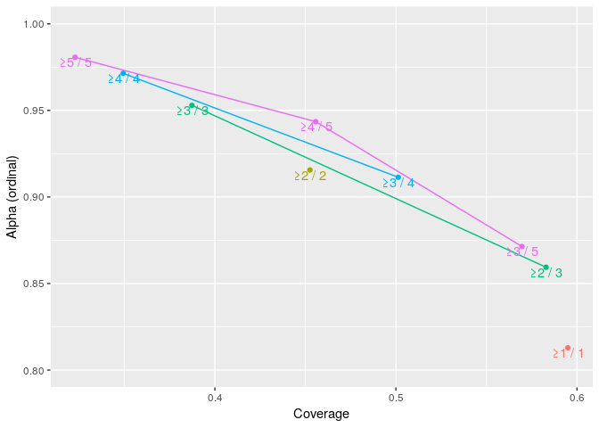
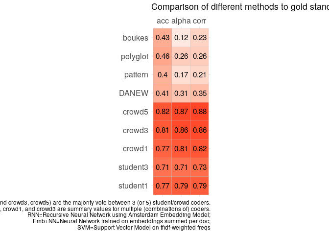
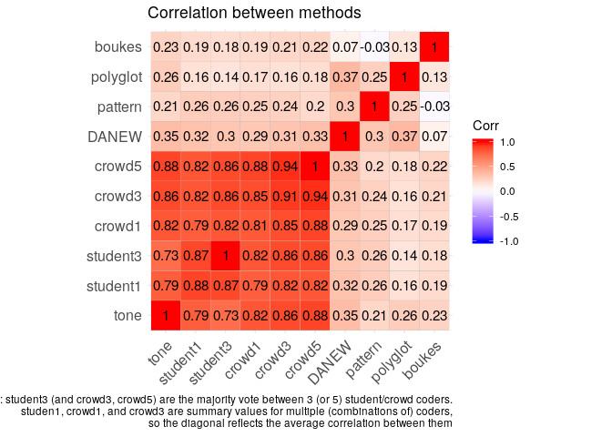

Comparison with gold
================
Wouter van Atteveldt
2019-05-12

-   [Setup](#setup)
-   [Data](#data)
    -   [Gold data](#gold-data)
    -   [Dictionary output](#dictionary-output)
    -   [Undergrad (student) coders](#undergrad-student-coders)
    -   [Crowd coding](#crowd-coding)
-   [Results](#results)
    -   [Crowd coding coverage / accuracy](#crowd-coding-coverage-accuracy)
    -   [Accuracy per method](#accuracy-per-method)
    -   [Correlations between various methods](#correlations-between-various-methods)

Setup
=====

Load the requiered packages and source the auxilliary functions from `lib/functions.R`:

``` r
library(tidyverse)
library(magrittr)
source("lib/functions.R")
```

Data
====

Load the data sets that contain the scoring of the gold data

Gold data
---------

``` r
gold = read_csv(data_file("gold.csv"))  %>% select(id, tone=gold) %>% filter(!is.na(tone))
```

Dictionary output
-----------------

``` r
dict = read_csv(data_file("dictionary_output.csv")) %>% rename(id=ID) %>% select(-headline_recessie) 
colnames(dict) = colnames(dict) %>% gsub(pattern = "headline_", replacement = "")
cmp = left_join(gold, dict)
```

Undergrad (student) coders
--------------------------

Read data and randomly choose up to 3 coders per article:

``` r
students = read_csv(data_file("manual_codings.csv"), col_types = "ciici") %>% select(id=ID, Codeur, tone) %>% filter(id %in% gold$id, !is.na(tone)) %>% mutate(id=as.numeric(id))

set.seed(1)
students %<>% arrange(sample(xtfrm(id)))
students %<>% group_by(id) %>% mutate(xcoder = row_number()) %>% ungroup
students %<>% filter(xcoder %in% 1:3) 
```

Calculate majority vote and add columns for each indidivudal coder and for the majority decision

``` r
v = vote(students, 2)

cmp %<>% left_join(students %>% filter(xcoder == 1) %>% select(id, student1_1=tone)) %>% 
  left_join(students %>% filter(xcoder == 2) %>% select(id, student1_2=tone)) %>% 
  left_join(students %>% filter(xcoder == 3) %>% select(id, student1_3=tone)) %>% 
  left_join(v %>% select(id, student3=tone)) %>% replace_na(list(student3=0))
```

Crowd coding
------------

``` r
crowd = read_csv(data_file("crowdcodings.csv"))
crowd %<>% group_by(id) %>% mutate(coder = row_number()) %>% filter(coder <= 5)
```

For each subset of coders, do majority voting, store results and accuracy

``` r
predictions = NULL
crowd_results = NULL
for(N in 1:5) {
  message(N, " / 5")
  # get all possible subsets of coders of size N
  coder_sets = combn(1:5, N, simplify = FALSE)
  for (i in seq_along(coder_sets)) {
    coders = coder_sets[[i]]
    minthres = floor(N/2) + 1
      for (thres in minthres:N) {
      v = vote(crowd %>% filter(coder %in% coders), thres)
      predictions[[paste(N, i, thres, sep = "_")]] = v
      crowd_results = rbind(crowd_results, compare(v, gold,  N=N, support=thres, i=i))
      }
  }
}
```

Create columns for crowd with 1, 3, and 5 coders:

``` r
crowd_pred = predictions[["5_1_3"]] %>% select(-support)
colnames(crowd_pred) = c("id", "crowd5")
for(keep in names(predictions)[grep("1_._1|3_.0?_2", names(predictions))]) {
  p = predictions[[keep]] %>% select(-support) 
  colnames(p) = c("id", paste0("crowd", gsub("_.$", "", keep)))
  crowd_pred =  full_join(crowd_pred, p, by="id")
}
cmp = left_join(cmp, crowd_pred)
```

Results
=======

Crowd coding coverage / accuracy
--------------------------------

``` r
res = crowd_results %>% group_by(N, support) %>% summarize(cov=mean(cov), acc=mean(acc), alpha=mean(alpha))

ggplot(res, aes(x=cov, y=alpha, color=factor(N), label=paste0("≥", support, " / ", N))) + geom_point() + geom_line() + geom_text(vjust=1) + 
  ylim(.8, 1) + theme(legend.position="none") + xlab("Coverage") + ylab("Alpha (ordinal)")
```



Accuracy per method
-------------------

Trichotomize all values and compute accuracy for each computed column:

``` r
# trichotomized accuracy
bin = function(x) ifelse(x<0, -1, ifelse(x>0, 1, 0))
res = list()
for(col in colnames(cmp)[-2:-1]) {
  acc = mean(bin(cmp[[col]]) == cmp$tone, na.rm=T)
  alpha = cmp[c(col, "tone")] %>% t %>% irr::kripp.alpha("ordinal")
  corr = cor.test(cmp[[col]], cmp$tone)
  res[[col]] = tibble(source=col, acc=acc, alpha=alpha$value, corr=corr$estimate)
}
order = c("tone", "student1", "student3", "crowd1", "crowd3", "crowd5", "CNN", "SVM", "DANEW", "pattern", "polyglot", "boukes", "LMcD", "AFINN", "LSS")

x = bind_rows(res) %>% separate(source, c("method", "i"), fill="right") %>% mutate(method=factor(method, levels=order)) %>% 
  group_by(method) %>% summarize(acc=mean(acc), alpha=mean(alpha), corr=mean(corr))
x
```

| method   |        acc|      alpha|       corr|
|:---------|----------:|----------:|----------:|
| student1 |  0.7670940|  0.7885231|  0.7929884|
| student3 |  0.7088608|  0.7073332|  0.7272013|
| crowd1   |  0.7680851|  0.8128921|  0.8206576|
| crowd3   |  0.8099718|  0.8594030|  0.8634279|
| crowd5   |  0.8222222|  0.8713943|  0.8754225|
| DANEW    |  0.4050633|  0.3084336|  0.3490408|
| pattern  |  0.3987342|  0.1726226|  0.2060846|
| polyglot |  0.4556962|  0.2592191|  0.2593636|
| boukes   |  0.4303797|  0.1164973|  0.2324745|

Display as heat map:

``` r
x %>% as.data.frame %>% (function (x) {rownames(x)=x$method; x %>% select(-method)}) %>% as.matrix %>% t %>% 
  ggcorrplot::ggcorrplot(lab=T, show.legend = F) +   
  labs(title = "Comparison of different methods to gold standard",
       caption = paste("Note: student3 (and crowd3, crowd5) are the majority vote between 3 (or 5) student/crowd coders.",
                       "student1, crowd1, and crowd3 are summary values for multiple (combinations of) coders.",
                       "RNN=Recursive Neural Network using Amsterdam Embedding Model;",
                       "Emb+NN=Neural Network trained on embeddings summed per doc;",
                        "SVM=Support Vector Model on tfidf-weighted freqs",
                       sep="\n")) +
  scale_x_discrete(position = "top") + theme(axis.text.x = element_text(angle = 0, hjust = .5))
```



Correlations between various methods
------------------------------------

``` r
x = cor(cmp[-1], use="pairwise") %>% as_tibble(rownames="method") %>% gather("method2", "cor", -method) %>% 
  separate(method, c("method", "i"), fill="right") %>% separate(method2, c("method2", "i2"), fill="right") %>%
  mutate(method=factor(method, levels=order), method2=factor(method2, levels=order)) %>% 
  group_by(method, method2) %>% summarize(cor=round(mean(cor), 2)) %>% spread(method2, cor)
x %>% as.data.frame %>% (function (x) {rownames(x)=x$method; x %>% select(-method)}) %>% as.matrix %>% t %>% 
    ggcorrplot::ggcorrplot(lab=T) +   labs(title = "Correlation between methods",
                                           caption = paste("Note: student3 (and crowd3, crowd5) are the majority vote between 3 (or 5) student/crowd coders.",
                                                           "studen1, crowd1, and crowd3 are summary values for multiple (combinations of) coders,",
                                                           "so the diagonal reflects the average correlation between them",
                                                           sep="\n"))
```


